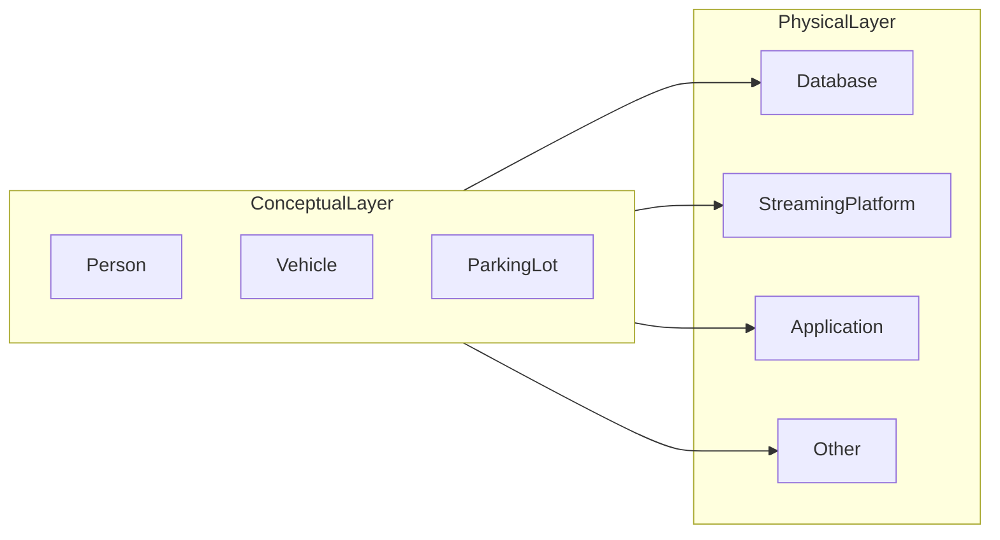
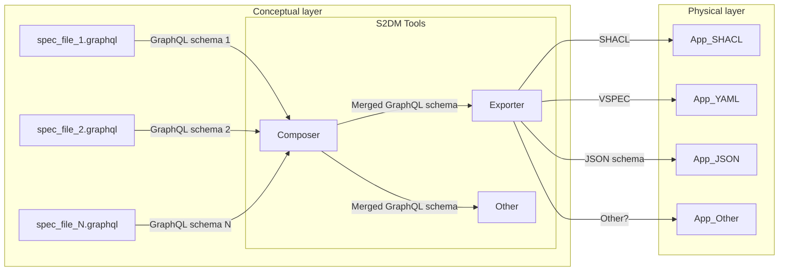

<h2 align="center">
 Simplified Semantic Data Modeling (S2DM)
</h2>

`S2DM` is an approach for modeling data of multiple domains.
It is **_simple_** in the sense that any Subject Matter Expert (SME) could contribute to a controlled vocabulary with minimal data modeling expertise.
Likewise, it is **_semantic_** in the sense that it specifies meaningful data structures, their cross-domain relationships, and arbitrary classification schemes.

> [!NOTE]
> Bear in mind the word `Simplified` in the name.
> This approach aims to foster the adoption of (some) good data modeling practices.
> It does not intent to re-invent, nor to replace long-standing standards, such as those of the [Semantic Web](https://www.w3.org/2001/sw/wiki/Main_Page).
> Hence, this approach does not incorporate advanced reasoning capabilities or the use of comprehensive ontologies typically associated with traditional semantic data modeling.

`S2DM` adopts data modeling best practices and reuses the following elements:

- [GraphQL Schema Definition Language (SDL)](https://graphql.org/learn/schema/).
  It provides a clear, human-readable syntax for defining data structures and relationships, making it easy for SMEs to understand and use without requiring deep technical expertise.
- [Simple Knowledge Organization System (SKOS)](https://www.w3.org/2004/02/skos/).
  It offers a straightforward framework for creating and managing hierarchical classifications and relationships between concepts, facilitating the organization and retrieval of knowledge in a way that is both intuitive and semantically rich.

To learn more about the background that has led to `S2DM`, as well as its design principles, please read the [S2DM Approach Primer](docs/APPROACH_PRIMER.md).

## Basic principle
The idea is that multiple systems in the physical layer (e.g., databases, streaming platforms, applications, etc.) can share the same concepts.
However, instead of arbitrarily modeling domains in the physical layer, the purpose is to have a unique way for specifying the concepts of common interest and its organizing principles in such a way that they are reused.
This principle is a core part of a [data-centric architecture](https://datacentricmanifesto.org/), reducing undesired duplications and [software waste](https://www.semanticarts.com/software-wasteland/) when it is systematically applied.

In this sense, `S2DM` is an approach to specify those concepts of interest systematically.
A more generic (and elaborated) diagram looks like the following:

## Getting started
The `S2DM` consists of the following artifacts:
* **_S2DM data modeling guideline_** - It explains how to formalize the data of a domain with the `S2DM` approach. In other words, how to create the specification files that will constitute the core of the conceptual layer. [Click HERE to start modeling a domain with `S2DM` approach](docs/MODELING_GUIDE.md).
* **_S2DM Tools_** - Code that support the proper usage of the `S2DM` guideline. It helps with the modeling language validation, identifiers, search functions, exporters, etc. [Click HERE to start using the `S2DM` tools](docs/TOOLS.md).

## Contributing
Contributions are welcome. [Click HERE to contribute](docs/CONTRIBUTING.md) (to the `S2DM` approach itself).
