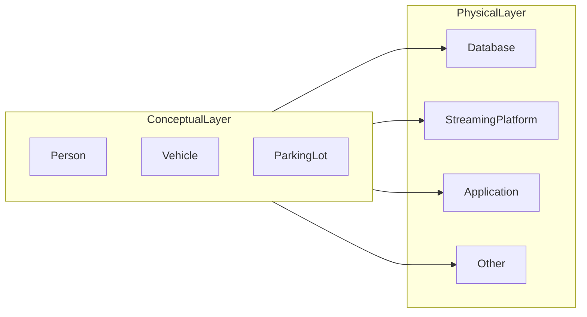
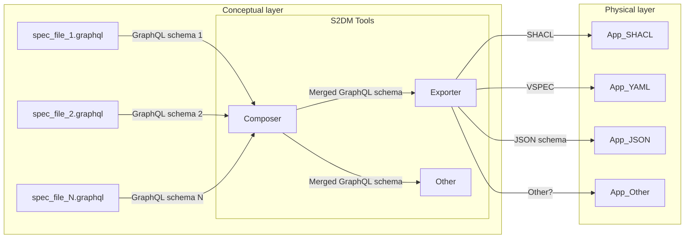

## Basic principle
The idea is that multiple systems in the physical layer (e.g., databases, streaming platforms, applications, etc.) can share the same concepts.
However, instead of arbitrarily modeling domains in the physical layer, the purpose is to have a unique way for specifying the concepts of common interest and its organizing principles in such a way that they are reused.
This principle is a core part of a [data-centric architecture](https://datacentricmanifesto.org/), reducing undesired duplications and [software waste](https://www.semanticarts.com/software-wasteland/) when it is systematically applied.

In this sense, `S2DM` is an approach to specify those concepts of interest systematically.
A more generic (and elaborated) diagram looks like the following:

