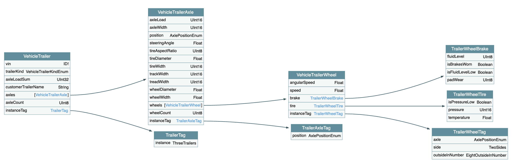

# Example: Trailer domain model

This example demonstrates how to model the `Trailer` domain using the `S2DM` approach.
The domain is broken down into several modular specification files, each describing a specific aspect or component of the trailer, such as axels, wheels, and others.
This modularization makes the domain model easier to maintain, extend, and reuse.

All modular specifications are combined to generate a complete schema file in SDL (Schema Definition Language), which is provided as [`full_schema.graphql`](https://github.com/COVESA/s2dm/tree/main/examples/trailer/full_schema.graphql).
This schema is compatible with GraphQL tools, allowing you to visualize and explore the domain model interactively.
For example, you can use the [GraphQL Voyager visualizer](https://graphql-kit.com/graphql-voyager/) to inspect the relationships and entities defined in the trailer domain.
It should look something like the following figure:

By following this example, you can learn how to apply the S2DM methodology to other domains, leveraging modular specifications and SDL generation for robust and flexible domain modeling.
