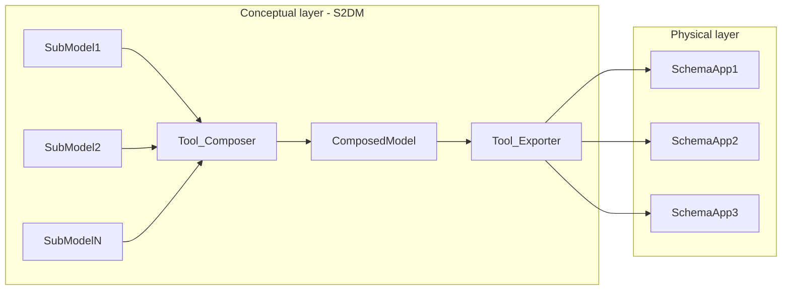
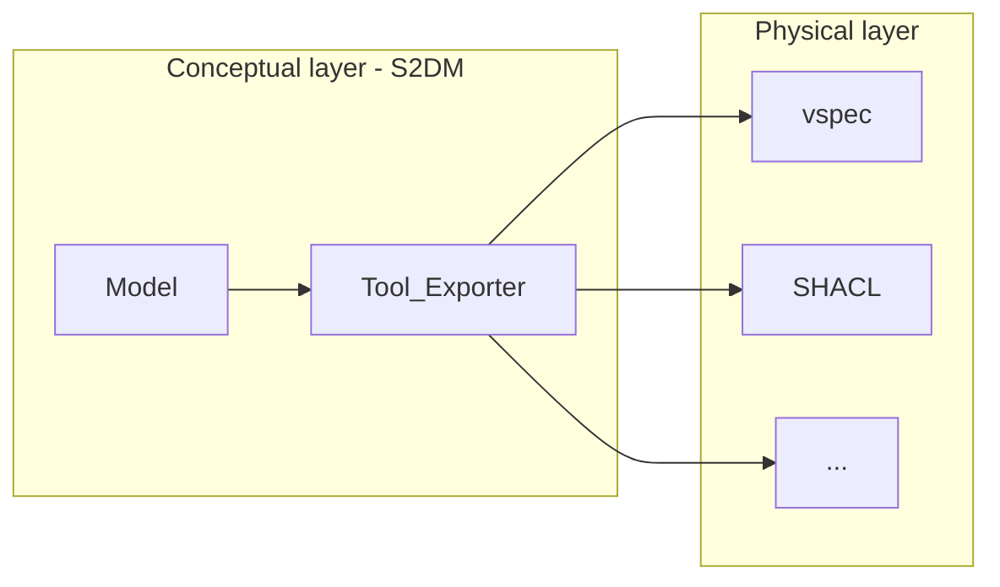

# Tools



## Exporter
A model done with the GraphQL SDL represents an specification.
The actual implementation of it is out of the scope.
However, to facilitate the implementation, the exporter tool parses the specified model and creates the artifact that is needed by the system in the physical layer.


The tools can currently export a given model into:
* vspec - `tools/to_vspec.py`
* SHACL - `tools/to_shacl.py`

### SHACL exporter
This exporter translates the given GraphQL schema to [SHACL](https://www.w3.org/TR/shacl/).

An object type in GraphQL, such as:
```gql
type Address {
  streetName: String! @cardinality(max: 1)
  ...
}
```
Results in the following SHACL:
```ttl
@prefix model: <http://example.ns/model#> .
@prefix sh: <http://www.w3.org/ns/shacl#> .
@prefix shapes: <http://example.ns/shapes#> .
@prefix xsd: <http://www.w3.org/2001/XMLSchema#> .

shapes:Address a sh:NodeShape ;
    sh:name "Address" ;
    sh:property
        [ sh:datatype xsd:string ;
        sh:maxCount 1 ;
        sh:minCount 1 ;
        sh:name "streetName" ;
        sh:path model:Address.streetName ],
        ...
    sh:targetClass model:Address .
```
In the previous example, the namespaces and their prefixes (i.e., `shapes` and `model`) can be arbitrarily assigned as arguments in the command.
* The `shapes` namespace should be the one that is used for validation purposes.
* The `model` namespace should be the future-proof location where the concept of interest is specified (aka., the ground truth).

The command might look like this:
```shell
s2dm shacl -s schema.graphql -o output.ttl -sn http://myShapesNamespece.eg/ -sfpref shapes -mn -sn http://myModelNamespece.eg/ -snpref model
```

Please, refer to the CLI help for further reference.
```bash
s2dm shacl --help
```

## Composer
Instead of modeling a huge monolithic model, GraphQL schemas can be specified in multiple small ones (aka., sub graphs).
Then, specific elements from different sub models can be stiched together to form the composed model with the structure needed.
To learn more about it, please refer to the [official documentation of the GraphQL Schema Definition Language](https://graphql.org/learn/federation/).
> TODO: This is part of the feature roadmap.
