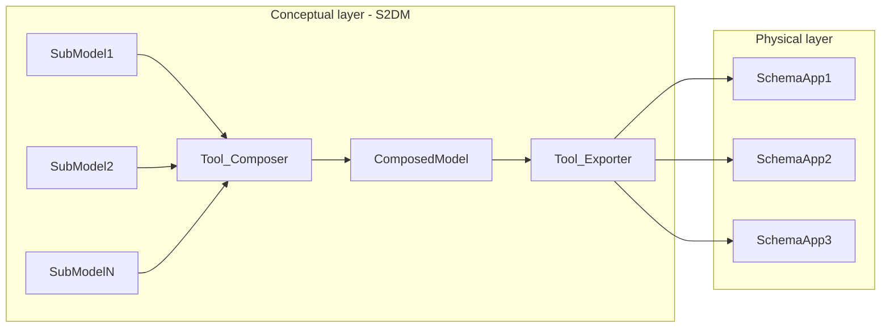
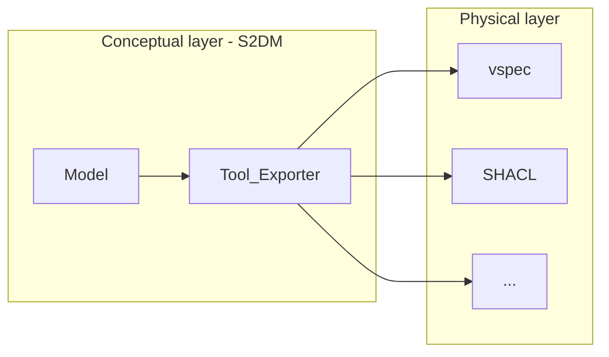

# Tools

## Exporter
A model done with the GraphQL SDL represents an specification.
The actual implementation of it is out of the scope. 
However, to facilitate the implementation, the exporter tool parses the specified model and creates the artifact that is needed by the system in the physical layer.

The tools can currently export a given model into:
* vspec - `tools/to_vspec.py`
* SHACL - `tools/to_shacl.py`

## Composer 
Instead of modeling a huge monolithic model, GraphQL schemas can be specified in multiple small ones (aka., sub graphs).
Then, specific elements from different sub models can be stiched together to form the composed model with the structure needed.
To learn more about it, please refer to the [official documentation of the GraphQL Schema Definition Language](https://graphql.org/learn/federation/).
> TODO: This is part of the feature roadmap.