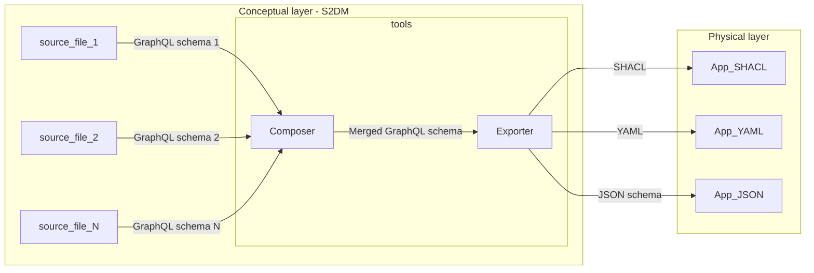
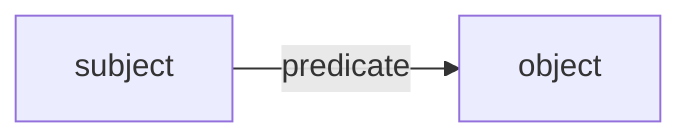
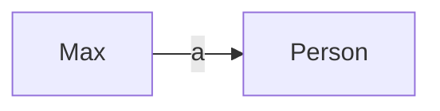
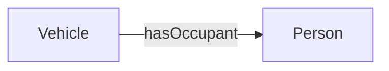
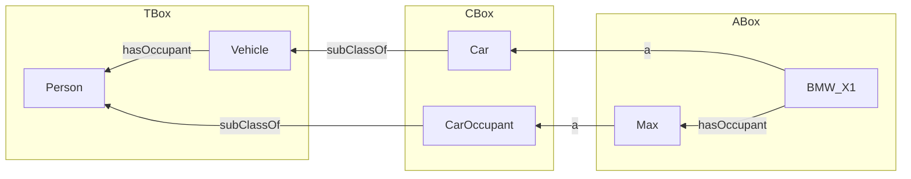
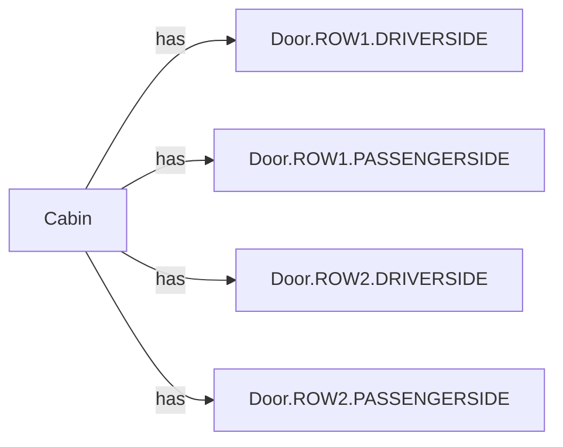
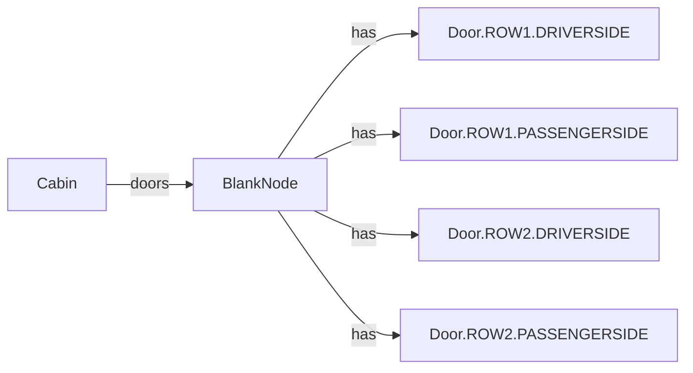

# Tools



## Composer

### Modularization
The tool can load multiple GraphQL schema files at once, as long as they are located in the same directory. This is currently done in the `utils` module with the [load function of the `Ariadne` package](https://ariadnegraphql.org/docs/modularization), which validates the syntax of every loaded file.
Therefore, it is possible to split a domain model into multiple smaller files. Such modularity is recommended to facilitate the further extension and maintenance of the domain model.
For example, in the figure shown above, schemas `1`, `2`, ..., `N` are merged into one before calling the exporter.

### Model validator
> TODO: Mechanisms to assess the integrity of the model. Examples: unique names, proper use of directives, completeness of types used within the model, correct construction of unique identifiers, etc.

### Arbitrary selection of concepts
> TODO: Mecahanism to arbitrarily select a sub set of the specification with only the desired concepts. Example: via the use of GraphQL introspection.

## Exporters
### General information about exporters
A model done with the GraphQL SDL represents an specification.
The actual implementation of it is out of the scope.
However, to facilitate the implementation, the exporter tool parses the specified model and creates the artifact that is needed by the system in the physical layer.

#### Available exporters
The tools can currently export a given model into:
* SHACL - `tools/to_shacl.py`

#### Supported field cases by exporter
> See `docs/MODELING_GUIDE.md` for more information on cases for fields and the custom directives, such as @noDuplicates.

| Case | `outputType`| SHACL|
|----------|----------|----------|
| **Nullable Singular Field**   | `NamedType`   | ✅ |
| **Non-Nullable Singular Field**   | `NamedType!`   | ✅ |
| **Nullable List Field**   | `[NamedType]`   | ❌ |
| **Non-Nullable List Field**   | `[NamedType]!`   | ❌ |
| **Nullable List of Non-Nullable Elements**   | `[NamedType!]`   | ❌ |
| **Non-Nullable List of Non-Nullable Elements**   | `[NamedType!]!`   | ❌ |
| **Nullable Set Field**   | `[NamedType] @noDuplicates` | ✅ |
| **Non-Nullable Set Field**   | `[NamedType]! @noDuplicates`   | ✅|


### SHACL exporter
This exporter translates the given GraphQL schema to [SHACL](https://www.w3.org/TR/shacl/).

The [Shapes Constraint Language (SHACL)](https://www.w3.org/TR/shacl/) is a framework used to validate data in [Resource Description Framework (RDF)](https://www.w3.org/RDF/) format.
In other words, if you work with the RDF graph data model and triple stores (i.e., RDF-based graph databases), SHACL is used to validate a certain RDF data graph.
Think of it as a set of rules or criteria that your data needs to meet. If you're working with data that follows certain structures or patterns, SHACL helps make sure everything is in the right place and follows the right format. It's like having a checklist to ensure your data is accurate and consistent, making it easier to work with and understand. This is especially useful in fields like data management and semantic web technologies, where data integrity is crucial.

#### RDF in a nutshell
The core of RDF is a triple consisting of:

So, an RDF data graph consists of a set of such triples. For example:




Since every resource is uniquely identified in RDF, the set of triples resembles a graph.
Abstract concepts define the most generic `Terminology` (aka., `TBox`).
For example, `Person` and `Vehicle`.
More specific concepts constitute the `Categories` (aka., `CBox`) of a domain.
For example, `CarOccupant` and `Car`.
Finally, the actual data (aka., `ABox`) is connected to the upper concepts that provide context.
For example, `Max` and `BMW_X1`.



SHACL is the language that specifies constraints that allow the validation of an RDF data graph.
More specifically:
* The `subject` can be constrained by a `nodeShape`.
* The `predicate` can be constrained by a `propertyShape`

#### Rules for SHACL property shapes
For any field that resolves in scalar:
- nodeKind is sh:Literal
- name is the field name from the GraphQL schema
- path is the field name from the GraphQL schema
- datatype is the xsd literal corresponding to the scalar type

For any field that resolves in a named type:
- nodeKind is sh:IRI
- name is the named type name from the GraphQL schema
- path is the generic "model:has"
- class is the named type name from the GraphQL schema
- node is the named type shape


#### Note on supported field cases
Implicitly, lists in the default field cases GraphQL refer to an array of values that could be duplicated.
In order to explicitly say that the intended content of the array should function as a set of unique values instead, the custom directive @noDuplicates is introduced.
```gql
type Person {
    nicknamesList: [String]  # Array with possible duplicate values
    nicknamesSet: [String] @noDuplicates  # Set of unique values
}
```

The SHACL exporter does not support lists at the moment bacause adding the cardinality constraints to the list elements represent the addition of an extra blank node, and the existing use cases do not currently need that.

##### Example of a supported structure
```gql
type Cabin {
  doors: [Door] @noDuplicates
  ...
}

type Door {
  instanceTag: Area2x2
}

type Area2x2 @instanceTag {
  row: TwoRows
  column: TwoColumns
}

enum TwoRows {
  FRONT
  REAR
}

enum TwoColumns {
  DRIVERSIDE
  PASSENGERSIDE
}
```

Here, each of the `object` nodes is an instance of a `Door` with a particular instance tag given as `sh:name` (e.g., `Door.ROW1.DRIVERSIDE`).
Therefore, the GraphQL non-nullable type modifier `!` can be applied only to the elements of the array and not to the array itself.
That is why not all field cases are supported at the momment by the SHACL exporter.

##### Example of an unsupported structure
```gql
type Cabin {
  doors: [Door]
  ...
}
```

This graph structure is not currently supported.
Here, there are two cardinalities: one for the list, and another for the elements in the list.

Please, refer to the CLI help for usage reference.
```bash
s2dm shacl --help
```

### JSON schema exporter

## Composer
Instead of modeling a huge monolithic model, GraphQL schemas can be specified in multiple small ones (aka., sub graphs).
Then, specific elements from different sub models can be stiched together to form the composed model with the structure needed.
To learn more about it, please refer to the [official documentation of the GraphQL Schema Definition Language](https://graphql.org/learn/federation/).
> TODO: This is part of the feature roadmap.


## ID Exporter

The ID exporter traverses a GraphQL schema and generates deterministic, unique hash IDs for schema elements. These IDs reflect changes in metadata that would constitute breaking changes.

### How It Works

1. **Schema Traversal**: The exporter traverses the GraphQL schema, processing each type and field.
2. **Spec Generation**: For each field, an `IDGenerationSpec` is created containing:
   - Name: Fully qualified name of the field
   - Data Type: Scalar type of the field
   - Unit: Unit of measurement (if applicable)
   - Allowed Values: For enum types
   - Minimum/Maximum: Range constraints (if applicable)
3. **ID Generation**: A 32-bit FNV-1a hash is generated from these properties.

### Example

Given a simple schema like:

```graphql
type Vehicle {
  averageSpeed(unit: Velocity_Unit_Enum = KILOMETER_PER_HOUR): Float
  adas: Vehicle_ADAS
}

type Vehicle_ADAS {
  isAutoPowerOptimize: Boolean
}
```

The ID exporter generates:

```json
{
  "Vehicle.averageSpeed": "0x9B020962",
  "Vehicle_ADAS.isAutoPowerOptimize": "0x1B10735A"
}
```

For detailed information about the ID generation mechanism, refer to the [IDGen README](../idgen/README.md).

## Concept URI Exporter

The Concept URI exporter traverses a GraphQL schema and generates URIs for concept definitions. These URIs represent the conceptual elements in the schema, independent of their specific realizations.

### How It Works

1. **Schema Traversal**: The exporter traverses the GraphQL schema, identifying objects, fields, and enums.
2. **URI Generation**: For each element, a concept URI is generated using a prefix and name.
3. **JSON-LD Output**: The results are formatted as JSON-LD, with proper context and relationships between concepts.

### Features

- Skips ID fields and the Query type
- Captures object-field relationships
- Identifies nested object relationships
- Formats output as valid JSON-LD with proper @context

### Example

Given a schema snippet:

```graphql
type Vehicle {
  averageSpeed(unit: Velocity_Unit_Enum = KILOMETER_PER_HOUR): Float
  adas: Vehicle_ADAS
}

type Vehicle_ADAS {
  activeAutonomyLevel: Vehicle_ADAS_ActiveAutonomyLevel_Enum
  isAutoPowerOptimize: Boolean
}

enum Vehicle_ADAS_ActiveAutonomyLevel_Enum {
  SAE_0
  SAE_5
}
```

The concept URI exporter generates:

```json
{
  "@context": {
    "ns": "https://example.org/vss#",
    "type": "@type",
    "hasField": {
      "@id": "https://example.org/vss#hasField",
      "@type": "@id"
    },
    "hasNestedObject": {
      "@id": "https://example.org/vss#hasNestedObject",
      "@type": "@id"
    },
    "Object": "https://example.org/vss#Object",
    "Enum": "https://example.org/vss#Enum",
    "Field": "https://example.org/vss#Field",
    "ObjectField": "https://example.org/vss#ObjectField"
  },
  "@graph": [
    {
      "@id": "ns:Vehicle",
      "@type": "Object",
      "hasField": ["ns:Vehicle.averageSpeed"]
    },
    {
      "@id": "ns:Vehicle_ADAS",
      "@type": "Object",
      "hasField": [
        "ns:Vehicle_ADAS.activeAutonomyLevel",
        "ns:Vehicle_ADAS.isAutoPowerOptimize"
      ]
    },
    {
      "@id": "ns:Vehicle.averageSpeed",
      "@type": "Field"
    },
    {
      "@id": "ns:Vehicle_ADAS.activeAutonomyLevel",
      "@type": "Field"
    },
    {
      "@id": "ns:Vehicle_ADAS.isAutoPowerOptimize",
      "@type": "Field"
    },
    {
      "@id": "ns:Vehicle_ADAS_ActiveAutonomyLevel_Enum",
      "@type": "Enum"
    },
    {
      "@id": "ns:Vehicle.adas",
      "@type": "ObjectField",
      "hasNestedObject": "ns:Vehicle_ADAS"
    }
  ]
}
```

This JSON-LD output shows that:
- `Vehicle` is an object type with a field
- `Vehicle.adas` has a nested object relationship with `Vehicle_ADAS` and is typed as `ObjectField`
- `Vehicle_ADAS` is an object type with two fields
- `Vehicle_ADAS_ActiveAutonomyLevel_Enum` is an enum type

## Spec History Registry

The Spec History Registry is a tool for tracking changes in schema realizations over time. It maintains a history of realization IDs for each concept, enabling traceability and auditability of schema evolution.

### How It Works

1. **Initialization**: The registry is initialized with concept URIs and their corresponding IDs.
2. **Tracking**: For each field in the schema, a `specHistory` property tracks the history of IDs with timestamps.
3. **Updates**: When schema changes occur, new IDs are appended to the history, maintaining a chronological record.

### Features

- Preserves the full history of realization IDs for each concept
- Records timestamps for each change
- Detects and logs new concepts and updated IDs
- Maintains valid JSON-LD structure

### Example

When initialized with the concept URIs and IDs, the registry creates a JSON-LD file with specHistory:

```json
{
  "@context": {
    "ns": "https://example.org/vss#",
    "specHistory": {
      "@id": "https://example.org/vss#specHistory",
      "@container": "@list"
    },
    "hasNestedObject": {
      "@id": "https://example.org/vss#hasNestedObject",
      "@type": "@id"
    },
    "Object": "https://example.org/vss#Object",
    "Enum": "https://example.org/vss#Enum",
    "Field": "https://example.org/vss#Field",
    "ObjectField": "https://example.org/vss#ObjectField"
  },
  "@graph": [
    {
      "@id": "ns:Vehicle.averageSpeed",
      "@type": "Field",
      "specHistory": [
        {
          "id": "0x9B020962",
          "timestamp": "2023-07-20T14:35:12.345678"
        }
      ]
    },
    {
      "@id": "ns:Vehicle.adas",
      "@type": "ObjectField",
      "hasNestedObject": "ns:Vehicle_ADAS"
    }
  ]
}
```

#### Update Example

When a field's implementation changes (resulting in a new ID), the specHistory is updated with the new entry:

```json
{
  "@id": "ns:Vehicle.averageSpeed",
  "@type": "Field",
  "specHistory": [
    {
      "id": "0x9B020962",
      "timestamp": "2023-07-20T14:35:12.345678"
    },
    {
      "id": "0xA2C48D71",
      "timestamp": "2023-08-15T09:22:45.123456"
    }
  ]
}
```

This history shows that the implementation of `Vehicle.averageSpeed` changed on August 15, 2023, with a new realization ID. The registry maintains this chronological record for all concepts.

### Usage

For initialization:
```bash
python src/tools/to_spec_history.py --concept-uri concept_uri.json --ids concept_ids.json --output spec_history.json --init
```

For updates:
```bash
python src/tools/to_spec_history.py --concept-uri new_concept_uri.json --ids new_concept_ids.json --spec-history spec_history.json --output updated_spec_history.json --update
```
